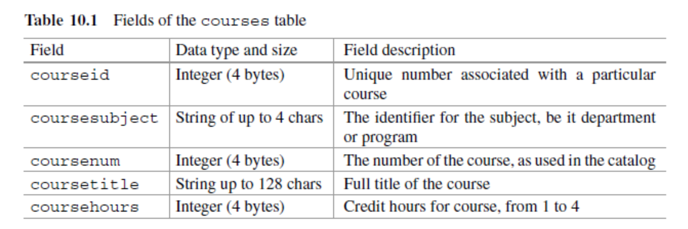

#  Relational Database 

+ A relational database is a type of database that stores and provides access to data points that are related to one another.
	+ Most common database format in industry
	+ Think about smartphones and apps
+ Relational databases are based on the relational model, which is a way of representing data in tables.
+ In a relational database, each row in the table is a record with a unique ID called the ** key**. The columns of the table hold attributes of the data. (also called features)

---
#  Database Management System 

Def: A database management system (DBMS) is **software** for managing databases and providing access to them.
+ A DBMS responds to “statements” given by application programs, custom-written or general-purpose, executing on behalf of users.
+ Statements are written in the language of the DBMS (e.g., SQL).
+ Responses include results of queries, messages...

---
#  What does a DBMS Do? 

+ A DBMS can:
	+ Create ore remove variables
	+ Take note of integrity rules (constraints)
	+ Take note of authorizations (who is allowed do what, on what)
	+ Update variables (honoring constraints and authorizations)
	+ Provide results of queries
	+ and more…
	
+ CART:
	+ Create
	+ Add
	+ Read
	+ Update
	
---
count: false
#  What does a DBMS Do? 

+ A DBMS can:
	+ Create ore remove variables
	+ Take note of integrity rules (constraints)
	+ Take note of authorizations (who is allowed do what, on what)
	+ Update variables (honoring constraints and authorizations)
	+ Provide results of queries
	+ and more…
	
+ CART:
	+ Create
	+ Add
	+ **Read:** We will focus on "reading" aka "obtaining" the data in this course.
	+ Update

---
#  Structure 

+ In the relational database model, the structure consists of multiple, inter-dependent tables
  + each table is comprised of rows and columns, just like in tabular model.
+ Aside: An individual table is also, in its mathematical context, called a relation. This is the origin of the term "relational database".
	+ A common misconception is that the name has to do with the "relationships" that might exist between tables.

---
#  Tables 

+ Tables are the main structures in a database.
+ Each table represents a single, specific subject.
	+ The order of rows and columns within a table has no importance.
+ Every table contains at least one column—known as the primary key—that uniquely identifies each of its rows.
+ The subject of a table can be either an object or an event .  When the subject is an object, the table represents something tangible, like a person, place, or thing.

---
#  Example 
```{r, echo=FALSE, out.width="80%", fig.cap="",fig.align='center'}

```
+ The `Customers` table above is one common example of a table representing an object.
+ `CustomerID` is the primary key of the `Customers` table.


---
#  Example 

+ When the subject of a table is an event, the table represents something that occurs at a given point in time and has characteristics you wish to record.
+ Below is a table representing an event: each row represents a doctor’s appointment.


---
#  Columns 

+ A column represents a characteristic of the subject of the table to which is belongs.
+ In the relational model, columns of a table are also called **fields**. (also called feature in machine learning.)
+ The column name should be descriptive, e.g., `FirstName`, `LastName`, `City`...

---
#  Rows 

+ A row represents a unique instance of a subject in the table.
+ Rows are often called **records**.
+ Each row is identified throughout the database by a unique value in the primary key column(s) of that row.
  + They key must be a unique identifier. E.g., `customerID`, `studentID`...

---
#  Example 

+ In the `Customers` table, each row represents a unique customer within the table, and the `CustomerID` column identifies a given customer throughout the database.

```{r, echo=FALSE, out.width="80%", fig.cap="",fig.align='center'}

```

---
#  Functional Dependencies 

+ Let's consider another example: records for each the courses offered at a college.
+ What fields should our database include?
+ Let's take a look on the Gateway?

---
count: false
#  Functional Dependencies 

+ Let's consider another example: records for each the courses offered at a college.
+ What fields should our database include?
+ Let's take a look on the Gateway?
+ The fields might include a `courseid`, used internally by the registrar to uniquely identify the course, and `coursesubject` like ECON or MATH, and a `coursenum`, like 201, or 350. Students would look in the catalog for, say, ECON 350 for the description of the course.
+ Other fields could be `coursetitle`, containing the full title of the course, and `coursehours`, an integer for the # of credit hours of the course.

---
#  Functional Dependency Continued 

+ In this example we can write the functional dependency: (LHS must be unique)

`courseid` ➡ `coursesubject`, `coursenum`, `coursetitle`, `coursehours`

+ If we can argue that the combination of `coursesubject` and `coursenum` is unique, we can, with equal validity, write:

`coursesubject`, `coursenum`  ➡  `courseid`, `coursetitle`, `coursehours`

---
count: false
#  Functional Dependency Continued 

+ In this example we can write the functional dependency: (LHS must be unique)

`courseid` ➡ `coursesubject`, `coursenum`, `coursetitle`, `coursehours`

+ If we can argue that the combination of `coursesubject` and `coursenum` is unique, we can, with equal validity, write:

`coursesubject`, `coursenum`  ➡  `courseid`, `coursetitle`, `coursehours`

+ Practice: is this a valid functional dependency?:

`coursenum`  ➡  `courseid`, `coursetitle`, `coursehours`

---
#  Functional Dependency Continued 

+ How about students? What should a students DB look like?

---
count: false
#  Functional Dependency Continued 

+ How about students? What should a students DB look like?

A unique `studentid`: it can serve on the LHS of the functional dependency of the `students` table:
`studentid`  ➡  `studentlast`, `studentfirst`, (other fields)
+ It may be tempting to try to identify students by their first and last name, as shown in the following potential dependency:
`studentlast`  `studentfirst`  ➡  `studentid`, (other fields)
+ Any potential issues with this?
---
count: false
#  Functional Dependency Continued 

+ How about students? What should a students DB look like?

A unique `studentid`: it can serve on the LHS of the functional dependency of the `students` table:
`studentid`  ➡  `studentlast`, `studentfirst`, (other fields)
+ It may be tempting to try to identify students by their first and last name, as shown in the following potential dependency:
`studentlast`  `studentfirst`  ➡  `studentid`, (other fields)
+ Any potential issues with this?
+ If there is possibility that a last name and first name combo to be not unique, the functional dependency (thus your DB) would be improperly specified.

---
#  Keys 

+ A **key** is one or more fields (columns) that can be used to uniquely identify an individual record (row).
+ **Super important:** ⚠️ In the relational model, there is only one record that corresponds to a given key.
+ A key is great, because it can always be used on the LHS of a functional dependency, and it would give you all the information you need about each of your subjects.
+ Aside: If a key is composed of more than one field, the key is called a composite key.

---
#  Primary and Foreign Keys 

+ The design of a relational database must identify, for every table, a primary key.
	+ A primary key uniquely identifies each row within a table.
+ A foreign key is a column (or group of columns) in a relational database that provide a link between data in two tables.
	+ The term foreign key is derived from the fact that the second table already has a primary key.

---
#  Primary  and Foreign Keys: Example
+ Consider an example with `Agents` and `Entertainers`. Notice below that an agent in `Agents` could work with multiple entertainers (or none). Aside: This relationship is called one-to-many.


+ `AgentID` is the primary key of the `Agents` table, and it is the foreign key in the `Entertainer` table.
	+ The Entertainer table already has a primary key: `EntertainerID`.
	+ In this relationship, `AgentID` is the column that establishes the connection between the `Agents` and `Entertainers` tables.

---
#  Another example: Find primary/foreign keys


---
#  Relationships: One-to-One 


---
#  One-to-Many Relationship 


---
#  Many-to-Many Relationship 

+ A pair of tables is in a many-to-many relationship when a single row in the first table can be related to many rows in the second table, and a single row in the second table can be related to many rows in the first table.
+ Now consider the following: what if you are given two tables and you find no direct way to merge the two?: use **linking (junction) table**


---
#  Linking Table Example 


---
#  Design Phase of a Table 

+ Let’s consider the design of a courses table.

```{r, echo=FALSE, out.width="80%", fig.cap="",fig.align='center'}

```

+ The dependencies are: (the second one is an alternative)
```{r, echo=FALSE, out.width="80%", fig.cap="",fig.align='center'}

```
```{r, echo=FALSE, out.width="80%", fig.cap="",fig.align='center'}

```


---
#  Table Schema Tool 

+ A table is depicted in a box.
	+ The primary key is indicated with a key icon.
	+ The icon next to the other fields is either filled in, or not, indicated if a field is required to be non-NULL.
	+ The `Indexes` section refers to the auxiliary structures that allow access when given a key.
	+ A `PRIMARY` index (key) will always exist. In this case, we are also showing a `SECONDARY` index that, while not shown in this picture, is the composite key of `coursesubject` and `coursenum`.
	
```{r, echo=FALSE, out.width="30%", fig.cap="",fig.align='center'}

```

---
#  Multiple Tables Design 

+ The rows (records) of the `courses` table represent exactly one course, like an item in the list of courses of a catalog for a college.
	+ We could extend our database by adding a `classes` table, which would include a record (row) for each class instance taught.
	
```{r, echo=FALSE, out.width="30%", fig.cap="",fig.align='center'}

```

---
#  Schema for courses and classes Tables: One-to-Many Relationship 
```{r, echo=FALSE, out.width="50%", fig.cap="",fig.align='center'}

```
+ The line denotes the relationship between the `classes` and `courses` tables.
	+ The “crows foot” on the `classes` side indicates that this is a *many* side of a table relationship.
	+ On the `courses` side, the relationship line is a hash, which indicates this is a *one* side of a table relationship.


---
#  Schema for courses and classes Tables: One-to-Many Relationship 
```{r, echo=FALSE, out.width="50%", fig.cap="",fig.align='center'}

```
+ Note the `courseFK` index in the `classes` table, which indicates that the `courseid` is a foreign key (for the `classes` table).
