#  Web-Scraping? 

+ In the final portion of our course, we will learn how to do "web-scraping"
 + Web-scraping is the process of obtaining data from websites using in an automated way
 + "Bot"?
```{r, echo=FALSE, out.width="40%", fig.cap="",fig.align='center'}

```
---

#  Web-Scraping? 
```{r, echo=FALSE, out.width="40%", fig.cap="",fig.align='center'}

```

---

#  Hierarchical Data: Recap
+ Websites use hierarchical data structures.
+ Recap: A hierarchical database is a data model in which data is stored in the form of records and organized into a tree-like structure. 
+ Keep in mind: one parent node can have many child nodes connected through links.
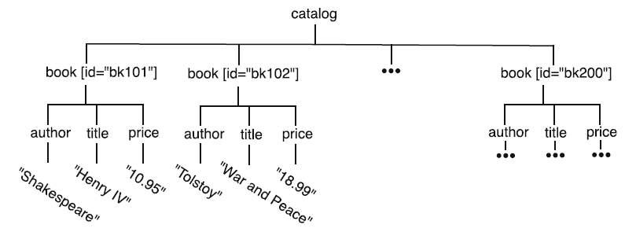

---
#  Why? 
+ Logistics: Hierarchical database models are simpler, and are more suitable for OS or websites.
	+ The one-to-many organization of data makes traversing the database simple and fast, which is ideal for use cases such as website drop-down menus or folder structures of an operating system.
	+ Information can easily be added or deleted without affecting the entirety of the database.
+ Data obtained from web scraping and from APIs are naturally hierarchical.
+ We will cover the most widely used formats: JSON, XML, and HTML then learn about how to scrape using the Selenium library.

---
#  Examples

+ Virtually all websites must store their data in some way, in many different industries, often describe live day-to-day data transactions:
	+ Stocks and Shares
	+ Financial transactions
	+ Medical data
	+ Mathematical data
	+ Scientific measurements
	+ News information
	+ Weather services
	
---
#  JSON
+ We have already seen JSON earlier in the semester.
+ JSON is a very convenient format for hierarchical data.
+ Integrates well with JavaScript.

```{python,eval=F}
{ 
    "Employee": 
    {
        "Name": "John Smith",
        "Salary": "$5"
    }
}
```

---
#  XML 

+ The eXtensible Markup Language (XML) is another hierarchical data format.
+ It was developed before JSON, peaked ~early 2000s
+ Slightly larger file sizes, but otherwise syntax is the only main difference.
	
```{xml}
<Employee>
    <Name>John Smith</Name>
    <Salary>$5</Salary>
</Employee>
```


---
#  Introduction to XPath 

+ XPath is a language that facilitates path-based operations in XML documents. 
  + locating, 
  + retrieving, 
  + updating data
+ The name “XPath” comes from “XML Path Language.”

---
#  `ind2.xml`
```{xml}
<ind2>
<FRA>
<y2007>
<pop>64.02</pop>
<gdp>2657.21</gdp>
</y2007>
<y2017>
<pop>66.87</pop>
<gdp>2586.29</gdp>
</y2017>
</FRA>
<GBR>
<y2007>
<pop>61.32</pop>
<gdp>3084.12</gdp>
</y2007>
<y2017>
<pop>66.06</pop>
<gdp>2637.87</gdp>
</y2017>
</GBR>
</ind2>
```
---
#  Example XPath String 

**Path:**  `/ind2/FRA/y2017`

**Return:**
```{xml}
Element='<y2017>
<pop>66.87</pop>
<gdp>2586.29</gdp>
</y2017>'
```

---
#  Example XPath String 

**Path:**  `/ind2/FRA/y2017/pop` <br>
**Return:** 
```{xml}
Element='<pop>66.87</pop>’
```
**Path:**  `/ind2/FRA/y2017/pop/text()` <br>
**Return:** 
```{xml}
Text='66.87'
```
+ `text()` extracts the text of the current node

---
#  Typical Goal 

+ The goal of XPath is often like `findall()` to get a "nodeset"
  + **Nodeset:** A set of nodes that satisfy a given path pattern.
  
+ In Python, once we have an XPath expression, we can give it as a parameter to the `xpath()` function of an `ElementTree` or an `Element` object, which returns the nodeset and the data we need.

---
#  Path Pattern Example 

**Path:**  `/ind2/FRA/*/pop` <br>
**Return:** 
```{xml}
Element='<pop>64.02</pop>’
Element='<pop>66.87</pop>’
```
+ **Note:** A wildcard matches any node at the given level, but not a path worth of nodes. The example above would not match nodes where 'pop' is a greatgrandchild of 'FRA'. (`*` can take only one node)
There are two elements in the returned nodeset .

---
#  `indicators.xml`
```{xml}
<indicators>
<country code="USA" name="United States">
<timedata year="1960">
<pop>180.67</pop>
<gdp >543.3</gdp>
<life>69.8</life>
<cell>0.0</cell>
<imports>16170.7</imports>
<exports>20535.0</exports>
</timedata>
<timedata year="1961">
<pop>183.69</pop>
<gdp >563.3</gdp>
<life>70.3</life>
...
```

---
#  Expressions 

+ The following two paths are equivalent, but the second one uses `[@code = 'FRA']` to specify a country

**Path:**  `/ind2/FRA/y2007/pop` <br>
**Path:** `/indicators/country[@code='FRA']/timedata[@year='2007']/pop` <br>
**Return:** 
```{xml}
Element='<pop>64.02</pop>'
```

---
#  Logical Or 

+ If we wanted the population of France and the USA for all years, we can use a logical `or`:

**Path:**  `/indicators/country[@code ='FRA' or @code ='USA']/*/pop` <br>
**Return:**
```{xml}
Element= '<pop>46.62</pop>’
Element= '<pop>47.24</pop>’
Element= '<pop>47.9</pop>’
Element= '<pop>48.58</pop>’
...
```

---
#  `school.xml`
```{xml}
<school>
<departments>
<department id="ANSO">
<name>Anthropology and Sociology</name>
<division>Social Sciences</division>
</department>
...
</departments>
<courses>
<course subject="ARAB" num="111">
<title>Beginning Arabic I</title>
<hours>4.0</hours>
<class id="40184">
<term>FALL</term>
<section>01</section>
<meeting>09:30-10:20 MWRF</meeting>
<instructorid >9216</instructorid>
</class>
</course>
...
</courses>
</school>
```
---
#  Logical And 

+ We can use a logical `and` to find the title `“Elementary Cinema Prod”` using course number `219` in the `school.xml` file as follows:

**Path:**  `/school/courses/course[@subject='CINE' and @num='219']/title` <br>
**Return:** 
```{xml}
Element= '<title>Elementary Cinema Prod</title>'
```
---
#  Match All Descendants 
+ The expression `//` is often a useful start of an XPath.
+ We could use this to find all nodes with a specified text. For example, in indicators, we can match all nodes with population larger than 300 million:

**Path:** `//pop[text()>300]`

---
#  Backing Up a Level 

+ Suppose we wanted to find what department offers the course with the title `"Elementary Cinema Prod"` in the `school.xml` data.
+ We can locate that course then back up one level and extract the subject attribute:

**Path:** `//title[text() = "Elementary Cinema Prod"]/../@subject` <br>
**Return:** 
```{xml}
Attribute='subject=CINE'
```
---
#  `breakfast.xml`
```{xml}
<menu>
<food price="5.95" calories="650">
<name>Belgian Waffles</name>
<description>Two of our famous Belgian Waffles with maple syrup</description>
</food>
<food price="7.95" calories="900">
<name>Strawberry Belgian Waffles</name>
<description>Light Belgian waffles covered with strawberries</description>
</food>
<food price="8.95" calories="900">
<name>Berry-Berry Belgian Waffles</name>
<description>Light Belgian waffles covered with fresh berries</description>
</food>
<food price="4.5" calories="600">
<name>French Toast</name>
<description>Thick slices made from our homemade sourdough bread</description>
</food>
<food price="6.95" calories="950">
<name>Homestyle Breakfast</name>
<description>Two eggs, bacon, toast, and hash browns</description>
</food>
</menu>
```
---
#  Another Example 

+ The following (equivalent) paths extract all food prices in the `breakfast.xml` data set.

**Input:** `//@price` <br>
**Input:** `/menu/food/@price`
```{xml}
Attribute='price=5.95’
Attribute='price=7.95’
Attribute='price=8.95’
Attribute='price=4.5’
Attribute='price=6.95'
```
* Caveat: Using `\\` can be very slow!

---
#  Searching Text Nodes 

+ XPath can also help us "search" text nodes, similar to SQL's `LIKE` operator
+ For example, in the `topnames.xml` data, the expression

**Input:** `//name[contains(text(),’Jo’)]/text()`

matches all name nodes where the text contains 'Jo'. This	includes 'John’ and would also contain 'Joanna' or 'MoJo’ if those were ever top names.

---
#  Searching Text Nodes Continued 

+ A related function, `starts-with()`, determines whether the text starts with a given string.
+ For example,

**Input:** `//name[starts-with(text(),’Jo’)]/text()`

matches 'John' but would not match 'MoJo'.

---
#  Python Programming with XPath 

+ Let's now look at how to use XPath expressions in Python.
+ We will first use the `etree` library to parse the XML file using the function `getLocalXML` defined in the next slide.

---
#  `getLocalXML() `
```{python}
def getLocalXML (filename, datadir ="."):
  # Set the data directory
  xmlPath = os.path.join( datadir, filename)
  try:
    tree = etree.parse (xmlPath)
    root = tree.getroot ()
    return root
  except:
    print("Error in parsing XML")
    return None
```
---
#  Obtain Root of breakfast.xml 
```
breakfastRoot =
 getLocalXML ("breakfast.xml", datadir)
```
---
#  Python Example 1 

Note that `xpath()` takes as input an XPath expression as a Python string and returns a list of nodes that match.
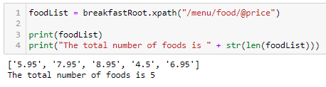

---
#  Python Example 2 

+ Below we find the cost of French Toast:

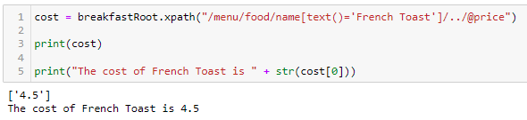

**Keep in mind:** `xpath()` always returns a list!

---
#  Python Example 3 

+ Below we use functional abstraction to find the cost of a provided food.

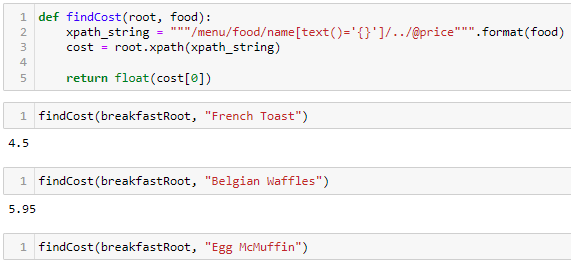

---
#  HTML Basics 

+ HTML stands for HyperText Markup Language.
+ Every website you think of is written in HTML.
+ It’s not a programming language like Python or Java: it’s a markup language. It displays information on a user's browser.
 + You can't program "Snake" in HTML. `r emo::ji("slightly_frowning_face")`
+ It describes the elements of a page through tags characterized by angle brackets.

---
#  Simple HTML Example 

.pull-left[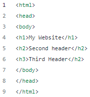]

.pull-right[] <br>

+ The document always begins and ends with `<html>` and `</html>`.
+ `<body></body>` constitutes the visible part of HTML document. 
+ `<h1>` to `<h3>` tags are defined for the headings.

---
#  Simple HTML Example
<br> 
.pull-left[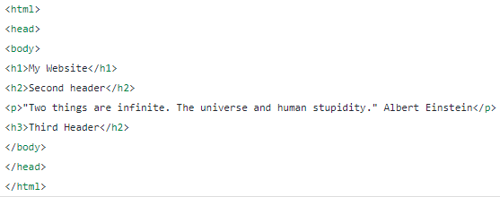]

.pull-right[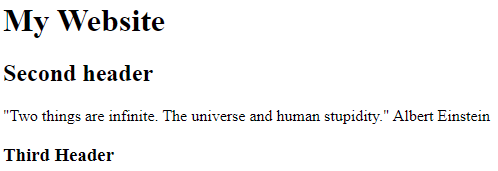]

---
#  Simple HTML Example

<br> 

.pull-left[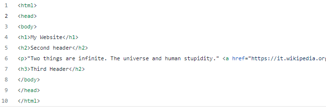]

.pull-right[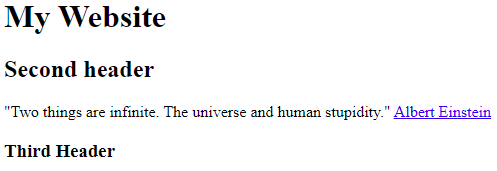]

---

.pull-left[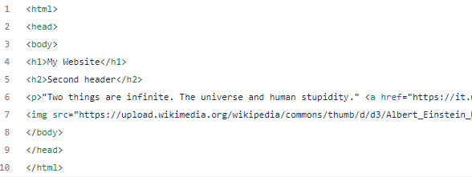]

.pull-right[]

---

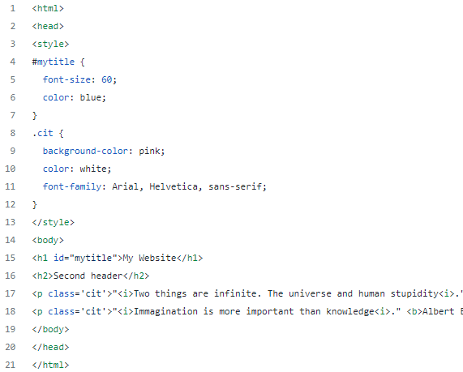

---
#  Classes and ID 

+ The `id` is an attribute to specify a unique ID for an element. For example, say, you want a particular color and size for the title in the first header.
+ The `class` attribute defines different elements within the same class. You would probably want to write some phrases with the same font, color, and size.
+ Both IDs and classes are defined in the `<style>` tags and the properties are defined in curly braces `{}`
+ The syntax for the class definition needs period, `.` followed by the name of the class. The ID needs a hashtag, `#` followed by the name of the ID.
+ Once you create the class and the ID in the `<style>` tags, you can pass them in the elements you want.


---
#  Tables 

+ Another important feature of HTML is the table, which is defined by the `<table>` tag.
+ Within the `<table>` tag, there are three principal tags to remember:
	+ The `<tr>` tag is used to build each row of the table.
	+ The `<th>` tag is used to define the header.
	+ The `<td>` tag is used to define the cell within the row.

---

.pull-left[This is the style: <br> 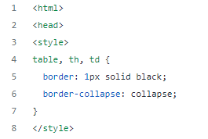 <br> This is the body and a table: 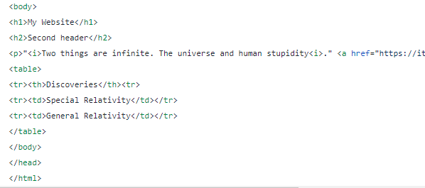]


.pull-right[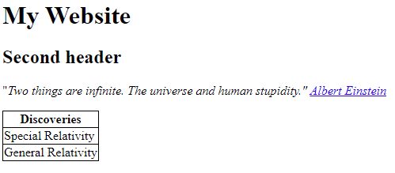]

---
#  Lists 

+ There are two types of lists that can be defined in HTML.
	+ The first one is an unordered list that starts with the `<ul>` tag, while the other type is an ordered list specified by the `<ol>` tag.
	+ Each item of both types of the list is specified by the `<li>` tag.

---

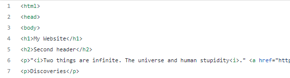

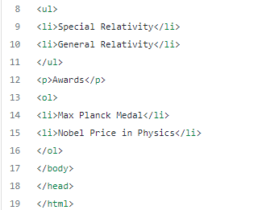

---

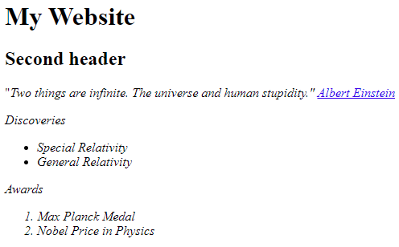

---
#  Blocks 

+ The most common elements of a website are usually called Blocks or Containers.
	+ They are useful to group together different elements and apply the same properties. So, the elements we did until now, `<h1>` to `<h3>`, `<p>`, `<ul>`, `<ol>`, can form one block together.
	+ For example, we want to divide the page into two parts. To create these two different blocks we can specify the `<div>` tag.

---

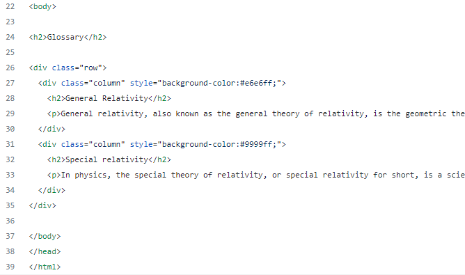

---


---
#  Difference Between XML and HTML 

+ XML and HTML are designed with different goals:
	+ XML is designed to *carry* data—with focus on what data is.
	+ HTML is designed to *display* data—with focus on how data looks.
	+ XML tags are not predefined like HTML tags are.

---
#  XML Separates Data from Presentation 

+ XML does not carry any information about display.
	+ The same XML data can be used in many different presentation scenarios.
	+ In many HTML applications, XML is used to store or transport data, while HTML is used to format and display the same data.

	
---
#  Regular Expressions (RegEx) 

+ Chapter 4.3 in Bressoud and White
	+ Used to extract specific groups of texts from repetitive patterns that occur in a larger body of text.
	+ Very powerful, but can get very complicated quickly!
		+ `(?<!\d)\d{4}(?!\d)`
	+ Test first before implementing (it’s fun):
[https://regex101.com](https://regex101.com/)

```{r, echo=FALSE, out.width="15%", fig.cap="",fig.align='center'}
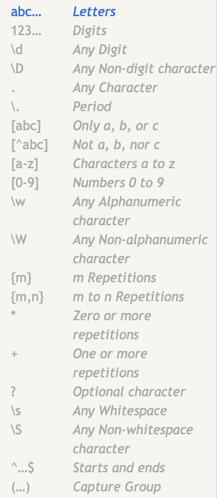
```


---
#  Regular Expressions (RegEx) 

+ Can use regular expressions in Python or R.
	+ import re in Python
```{r, echo=FALSE, out.width="50%", fig.cap="",fig.align='center'}
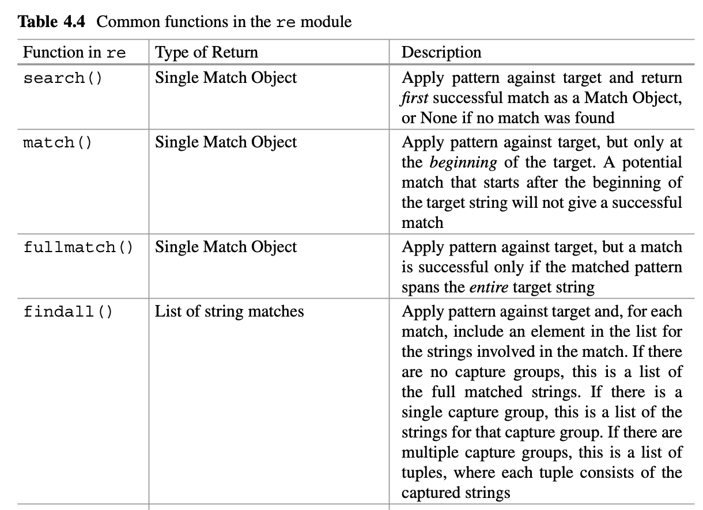
```

---
#  Regular Expressions (RegEx) 

+ Examples:
```{python,eval=F}
import re
text = "It's true that string cleaning is a topic in the chapter. string editing is another topic."
re.findall ("string \w+\s" , text)
['string cleaning ', 'string editing ']

new_text = "new text here! "
re.sub ( "string \w+\s" , new_text , text)
It is true that new text here! is a topic in this chapter. new text here! is another topic.
```
---
#  Regular Expressions (RegEx) 

+ Lazy vs greedy matching:
```{python,eval=F}
test_string = " stackoverflow "
greedy_regex = "s.*o"
lazy_regex = "s.*?o"
print("The greedy match is {re.findall(greedy_regex , test_string)[0]}")
print("The lazy match is {re.findall(lazy_regex , test_string)[0]}")
The greedy match is stackoverflo 
The lazy match is stacko
# get words between "string" and "topic"
text = "It's true that string cleaning is a topic in the chapter. string editing is another topic."
re.findall ( "string (.*?) topic" , text)
['cleaning is a', 'editing is another']
```

---
#  Web-scraping: What is Web Scraping? 

+ Web scraping is a technique for gathering data or information from web pages in an automated way.
+ It could be used to extract data from a website that does not have an API, or we want to extract a LOT of data which we can not do through an API due to rate limiting.
+ Through web scraping we can extract any data which we can see while browsing the web.

---
#  What is an API? 

+ The term API stands for “Application Programming Interface.”
+ APIs are systems that enable two software to communicate with each other using a set of protocols.
+ For example, the weather bureau’s software system contains daily weather data. The weather app on your phone “talks” to this system via APIs and shows you daily weather updates on your phone.

---
#  API Continued 

+ API architecture is usually explained in terms of client and server.
+ The application sending the request is called the client, and the application sending the response is called the server.
+ So in the weather example, the bureau’s weather database is the server, and the mobile app is the client.
+ Many important websites provide APIs, such as:
	+ GitHub
	+ IMDb (movie database)
	+ Wikipedia
	+ Twitter

---
#  Web Scraping vs. Using an API 

+ Web Scraping is not *rate limited*
+ Anonymously access the website and gather data
+ Some websites do not have an API
+ Some data is not accessible through an API
+ and many more !

---
#  Web Scraping in Real Life 

+ Extract product information
+ Extract job postings and internships
+ Extract offers and discounts from deal-of-the-day websites
+ Crawl forums and social websites
+ Extract data to make a search engine
+ Gather weather data

---
#  Essential Parts of Web Scraping 

+ Web Scraping follows this workflow:
	+ Get the website's content - using HTTP library
	+ Parse the HTML document - using any parsing library
	+ Optional: Have the crawler click on “next page” and continue grabbing data for all pages
	+ Store the results - either in a `db`, `csv`, `txt`, etc

---
#  Useful Libraries for Web Scraping 

+ Beautiful Soup
	+ lxml
	+ Selenium (we will use Selenium!)
	+ Scrapy

---
#  When to Use Web Scraping 

+ Make sure to check the existence of APIs or FTP servers before scraping.
+ If only no other way of getting the data exists, consider web scraping.
+ Make sure to follow terms of use in all scraping projects. (research use is typically ok, selling scraped data for profit not ok):
	+ E.g., https://help.instagram.com/581066165581870 
	+ https://www.socialmediatoday.com/news/meta-launches-new-legal-proceedings-against-data-scraping-helping-to-estab/626593
